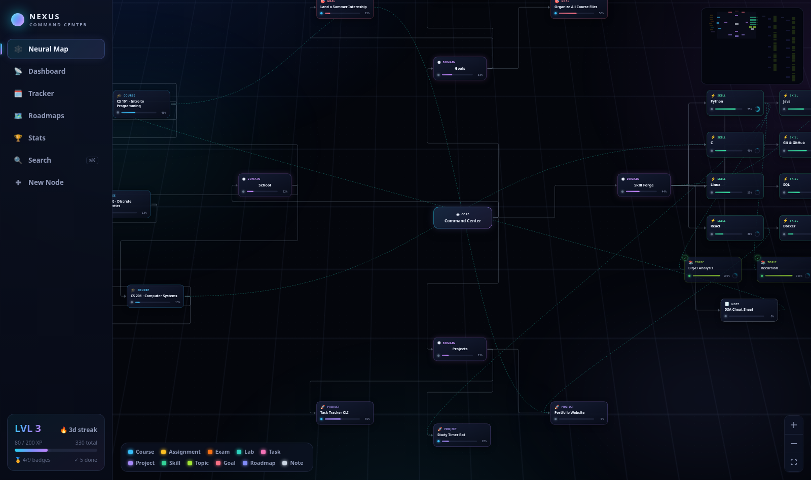

# NEXUS — Developer Life OS

A **local-first, gamified second brain** for developers and CS students. Courses,
assignments, projects, skills, files, notes and learning roadmaps live as connected
nodes on an interactive skill-tree map — with XP, levels, streaks, badges and
evidence-based skill confidence to keep you moving.

Everything runs on your machine. No account, no cloud, one SQLite file.
**Starts as a clean slate** — your data, your map. A demo workspace is one click away
(and one click to remove).



## Features

- **Neural Map** — an interactive knowledge graph (pan / zoom / drag / connect / collapse)
  with glowing HUD-style nodes for courses, coursework, projects, skills, goals, notes and roadmaps
- **Locked / unlocked progression** — roadmap topics with unmet prerequisites render locked,
  skill-tree style, and unlock as you complete what comes before
- **Skill confidence scoring** — a transparent heuristic estimates how likely you've actually
  *demonstrated* each skill from linked evidence (files, repos, projects, notes, completed work):
  `0–25 Not enough evidence · 26–50 Some exposure · 51–75 Practiced · 76–100 Demonstrated`
- **Node detail panel** — status, progress, due date, XP value, markdown notes, next actions,
  structured learning guide, confidence breakdown, linked files/folders/repos/URLs, connected nodes
- **Learning roadmaps** — 11 curated roadmap.sh-style paths (CS, DSA, Backend, Frontend,
  Full Stack, DevOps, Cybersecurity, Linux, Databases, Networking, Operating Systems).
  Every topic ships with *why it matters*, *what to learn*, real resource links,
  prerequisites and completion criteria — or import your own JSON
- **Mission Control dashboard** — overdue / today / week / month deadlines, weekly XP strip,
  overall completion, course & project progress, goals
- **Operator Profile (Stats)** — level ring, XP-per-week chart, 14-day activity, records,
  confidence distribution, strongest skills, badge gallery, activity feed
- **Deadline Tracker** — all coursework grouped by course with one-click status changes
- **Gamification** — XP per completion, levels, daily streaks, 9 badges, toasts
- **Search** — `Ctrl/⌘+K` palette across titles, descriptions, notes and linked files
- **Deep links** — `/?view=stats`, `/?node=<id>` jump straight to a view or node
- **Local-first** — SQLite database in `data/nexus.db`; copy it to back up, delete it to start over

## Quick start

Requires **Node.js 18+** (tested on 20).

```bash
npm install
npm run dev        # dev mode: API on :4000, UI on http://localhost:5173
```

or production mode (single port):

```bash
npm start          # builds the UI, serves everything on http://localhost:4000
```

The app starts **empty**. From the onboarding screen you can create your first node,
import a learning roadmap, or load the demo workspace to explore.

### Docker (optional)

```bash
docker compose up --build   # http://localhost:4000, data persisted in a named volume
```

## Commands

| Command | What it does |
|---|---|
| `npm run dev` | Dev servers with hot reload (Vite + API) |
| `npm run build` | Build the UI into `dist/` |
| `npm start` | Build UI + serve app on :4000 |
| `npm run server` | API only (serves `dist/` if present) |
| `npm run demo` | Load the sample workspace (only into an empty DB) |
| `npm run demo:reset` | **Wipe everything** and load the sample workspace |
| `npm test` | Run the Vitest suite (confidence scoring + roadmap importer) |

## Keyboard & mouse

- `Ctrl/⌘ + K` — search palette
- Drag from a node's right handle to another node — create a connection
- Click an edge, press `Delete` — remove a connection
- `−` button on a node — collapse its subtree
- Click any node — open the detail panel

## Add your own roadmap

Drop a JSON file into `roadmaps/` (format documented in `server/roadmaps.js`) or use
**Roadmaps → Import JSON file**. Topics support `why`, `learn[]`, `resources[]`,
`prerequisites[]` and `criteria[]` — prerequisites become locked/unlocked states on the map.

## Where things live

```
server/     Express API + SQLite (better-sqlite3): schema, gamification, confidence
            scoring, roadmap importer, optional demo data
src/        React UI (Vite + React Flow): map, dashboard, tracker, roadmaps, stats
roadmaps/   Learning-path JSON files — add your own here
data/       nexus.db (SQLite) — your entire second brain, git-ignored
```

## Screenshots

> *Add your own screenshots here — `docs/` holds the hero shot used above.*

## License

MIT — see [LICENSE](LICENSE). Replace the copyright holder placeholder with your name.

---

For architecture, schema, API reference and how to continue development (human or AI),
see **[AGENTS.md](AGENTS.md)**.
